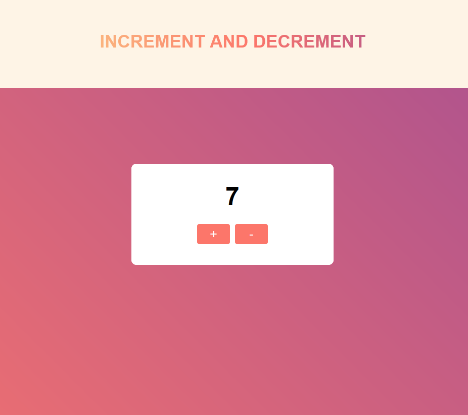

# React Counter

Incremental and decremental counter using React with Redux.

## Browser Compatibility

All of the latest versions of <b>Chrome</b>, <b>Firefox</b>, <b>Edge</b> and <b>Opera</b> browsers are supported.

## Installation

#### Steps to install

<ol>
  <li>download the folder/git clone the repo</li>
  <li>cd root directory of the folder</li>
  <li>npm install</li>
  <li>npm start</li>
  <li>access localhost:3000 on your browser</li>
</ol>

## Screenshot

See code <a href="https://github.com/veronikagregorec/react-counter/tree/main/src">here</a>
